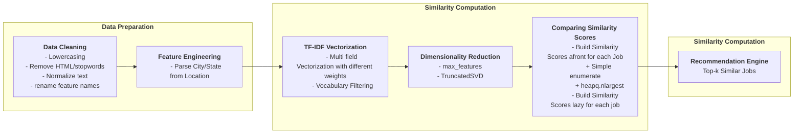
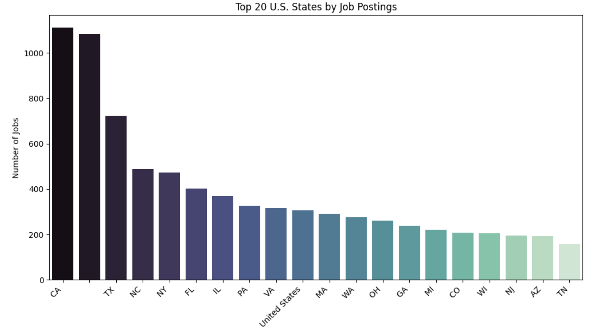
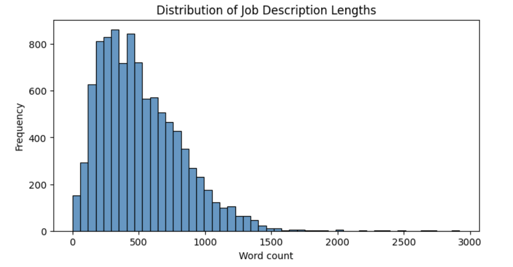
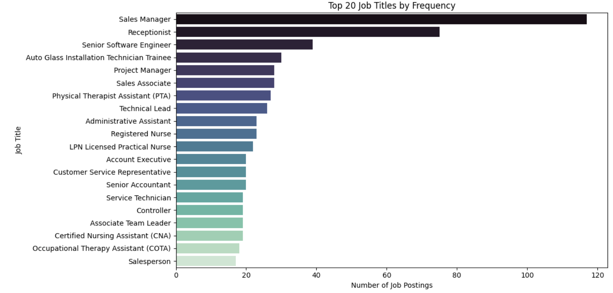

# Improving Job Discovery Through Recommendation

## Problem Statement
This project builds a content-based job recommendation system using real-world job postings data (from LinkedIn).
The system improves the job discovery process by recommending similar roles once a user views or selects a specific job. Instead of requiring job seekers to know every possible job title variation, the engine highlights relevant opportunities by analyzing:
Job descriptions
Skills and responsibilities
Titles 
Location(State)
The outcome is a more personalized and efficient job search experience.

## Objectives
- Develop a TF-IDF + Cosine Similarity-based recommendation engine.
- Develop a content-based recommendation system using Job descriptions, Skills and responsibilities, Titles State
- Handle State abbreviations (CA, NC)
- Validate the improvements using Stemming and Lemmatizing
  
## Dataset
The dataset is sourced from the [LinkedIn Job Postings dataset](https://huggingface.co/datasets/datastax/linkedin_job_listings).It contains millions of job postings with fields such as:
- job_id
- title
- job description
- skills
- location(city and state)
- formatted_experience_level
- remote_allowed
- company_name

For experimentation, subsets of 10K and 50K  were used.

## Tech Stack
- Python 3.12+
- Jupyter Notebook for prototyping
- pandas, numpy for data handling
- matplotlib, seaborn for charts
- scikit-learn for TF-IDF, cosine similarity
- PorterStemmer, spaCy(Lemmatizer)


## Approach

### Preprocessing & Feature Engineering

- Clean job descriptions, skills text, location
- Handle missing values
- Understand the datasets using the following plots
    - **State**
        - At least 11% of the state column values were missing in the job postings dataset. Since the state field is an important feature for filtering and contextual recommendations, we applied an imputation strategy to fill in these missing values.
        - **Fuzzy Matching Against Location** For rows with missing state, we leveraged the location column (which often contains city and state names in text form, e.g., "San Francisco, California, United States").Using fuzzy string matching (via the rapidfuzz library), we searched for the closest matching state abbreviation or name from the reference set.
        - **Fallback Default** If no strong fuzzy match was found, the missing state value was imputed as "US" to indicate an unspecified U.S. location.
    - **Job Description & Skills**
      - Both the job description and skills description fields capture the requirements of a role, and they are stored as free-text fields. On average, each contains around 600 words.
      - To measure textual similarity between jobs, these two fields are combined into a single feature and transformed using TF-IDF vectorization. This allows the recommender system to better capture shared responsibilities, qualifications, and skillsets across postings.
      <p float="left">
         
         
    </p> 
    <p float="center">
         
    </p> 


### Recommendation Engine

- **Generate TF-IDF Vectors Using Multiple Techniques**

  - Title: Experiment with different n-gram ranges to capture variations and context in job titles.
  - Description: Apply text preprocessing such as stop word removal, stemming, or lemmatization to normalize free-text job descriptions.
  - State: Use a custom regex-based extractor to standardize and match U.S. state abbreviations from location data.
  

- **Weighted Combination**
    - Assign different weights to each field (title, description, state) to balance their relative influence in the similarity calculation.

## Installation

Clone the repository:
   ```bash
   git clone https://github.com/premkumargit/job_recommandation.git
   cd job_recommandation
   ```

## Usage
- Start Jupyter Notebook as below
  ``` bash
    jupyter notebook
  ```
- Open the notebook either in Jupyterlab or jupyter notebook [recommendation_job_posting.ipynb](https://github.com/premkumargit/job_recommandation/blob/main/recommendation_job_posting.ipynb) and run all the cell


- Run in voila
  ``` bash
   pip install voila
   voila recommendation_job_posting.ipynb
  ```
## Evaluation
- **Practical:** Validate with test queries (e.g., Therapist → School Behavior Technician).  
- **Scalability:** Test across 10k, 50k, and millions of postings.  

## Outcome
The recommendation engine bridges the semantic gap in job search by:  
- Surfacing relevant roles not captured by keyword search.  
- Expanding employer reach to qualified candidates.  
- Improving candidate experience and platform engagement.
